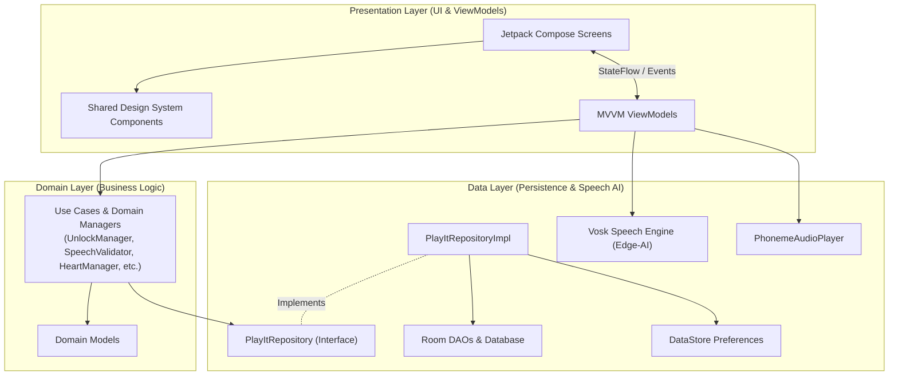

# playIT (BasaTrack)

> **An offline-first, edge-AI driven mobile literacy and phonics learning platform for early childhood readers.**

[](https://developer.android.com)
[](https://developer.android.com/topic/architecture)
[](https://developer.android.com/jetpack/compose)
[](https://alphacephei.com/vosk/)

---

## Overview

**playIT** (also known as **BasaTrack**) is an offline-first Android literacy application built specifically for early childhood learners (Grade 3 / early readers). It implements the Marungko reading methodology across 28 phonemes organized into 7 progressive letter groups. 

Traditional digital literacy tools frequently fail in resource-constrained or offline environments due to mandatory cloud connectivity and remote AI speech processing. **playIT** solves this barrier by running all speech recognition locally on the device using an embedded edge-AI engine (Vosk JNI bridge), guaranteeing zero network dependency and absolute child data privacy (no voice data ever leaves the device).

---

## Key Features & Curriculum Flow

* **3-Stage Phonics Loop**: Every letter module guides children through three distinct learning activities:
  1. **Hear It**: Audio modeling of phoneme pronunciation and vocabulary connection.
  2. **Say It**: Real-time voice production practice evaluated by on-device speech recognition.
  3. **Find It**: Interactive image-discrimination grid reinforcing phoneme-to-visual associations.
* **Word Blender (`BlendItScreen`)**: Milestone checkpoint challenges at the end of letter groups where children drag and tap phoneme tiles to build and sound out full words.
* **35-Node Gamified Progression Map (`MapScreen`)**: Visual journey map guiding learners through letter unlocks, group checkpoints, and star achievements with active-node breathing animations.
* **Offline Edge-AI Speech Recognition**: Powered by the Vosk engine with a custom 28-phoneme phonetic fallback map tailored for young Filipino learners.
* **Parent & Educator Dashboard (`ParentDashboardScreen`)**: Secure, arithmetic-gated dashboard tracking 28-letter mastery breakdown, retention metrics, and local PDF progress report generation (`ReportPreviewScreen`).
* **Design System v1.0 & Accessibility**: Built with custom tokens (`ui/theme/`), Nunito typography scale, non-punitive gamification (hearts & stars), mascot coaching states, TalkBack screen-reader support, and a system-wide reduced-motion accessibility mode.

---

## Tech Stack & Architecture

playIT is engineered following Android's recommended **MVVM + Clean Architecture** guidelines (Presentation, Domain, Data layers):

* **Language**: Kotlin 1.9+
* **UI Framework**: Jetpack Compose with Material 3 integration
* **Architecture**: Unidirectional Data Flow (UDF) with MVVM ViewModel state hoisting
* **Database & Storage**: Room ORM (SQLite) with KSP annotation processing, Jetpack DataStore Preferences for session and UI settings
* **Edge Speech AI**: Vosk Android SDK (JNI C++ bridge to offline acoustic models)
* **Media & Audio**: Custom `AudioPlayer` wrapping Android `MediaPlayer` with concurrent playback safety
* **PDF Engine**: Native Android `PdfDocument` / `Canvas` rendering pipeline
* **Asynchronous Processing**: Kotlin Coroutines & `StateFlow` / `SharedFlow` reactive streams
* **Build System**: Gradle Kotlin DSL (`build.gradle.kts`) with ProGuard/R8 minification rules

---

## Architecture Overview

For a detailed breakdown of the software layers, domain use cases, and repository pattern, see the [Architecture Documentation](docs/architecture.md).



---

## Setup & Build Instructions

### Prerequisites
* **Android Studio**: Jellyfish (2023.3.1) or newer recommended
* **JDK**: Version 17
* **Android SDK**: Min API 26 (Android 8.0 Oreo), Target API 34 (Android 14)
* **Hardware/Emulator**: Device or emulator running API 26+ with microphone capability for speech recognition tests

### Building from Source

1. **Clone the Repository**:
   ```bash
   git clone https://github.com/zendrix-hub/playIt.git
   cd playIt
   ```

2. **Build Debug APK**:
   ```bash
   ./gradlew assembleDebug
   ```

3. **Run Unit Tests**:
   ```bash
   ./gradlew test
   ```

4. **Run Instrumented DB & Repository Tests**:
   ```bash
   ./gradlew connectedAndroidTest
   ```

5. **Build Release APK (ProGuard Minified)**:
   ```bash
   ./gradlew assembleRelease
   ```

---

## Screenshots & Visuals

*(Screenshots and demo recordings will be embedded below as release assets are generated in DEPLOY-04 / DEPLOY-05)*

| Progression Map (`MapScreen`) | Phonics Activity (`SayItScreen`) | Parent Dashboard (`ParentDashboardScreen`) |
|:---:|:---:|:---:|
| *[ Map Screenshot Placeholder ]* | *[ SayIt Screenshot Placeholder ]* | *[ Dashboard Screenshot Placeholder ]* |

---

## Roadmap & Maintenance

playIT development follows a strict, single-source-of-truth operational manual:
* **[playIT Execution Roadmap](playIT_Execution_Roadmap.md)**: Contains the 15-phase hardening strategy, engineering review resolutions, quality gates, and automated test instructions for all 103 roadmap checklist items.

---

## License & Privacy Statement

**Privacy First**: playIT collects **zero personal data** and transmits **zero audio recordings** over the internet. All user progress and profile data remain strictly on the local device storage.
