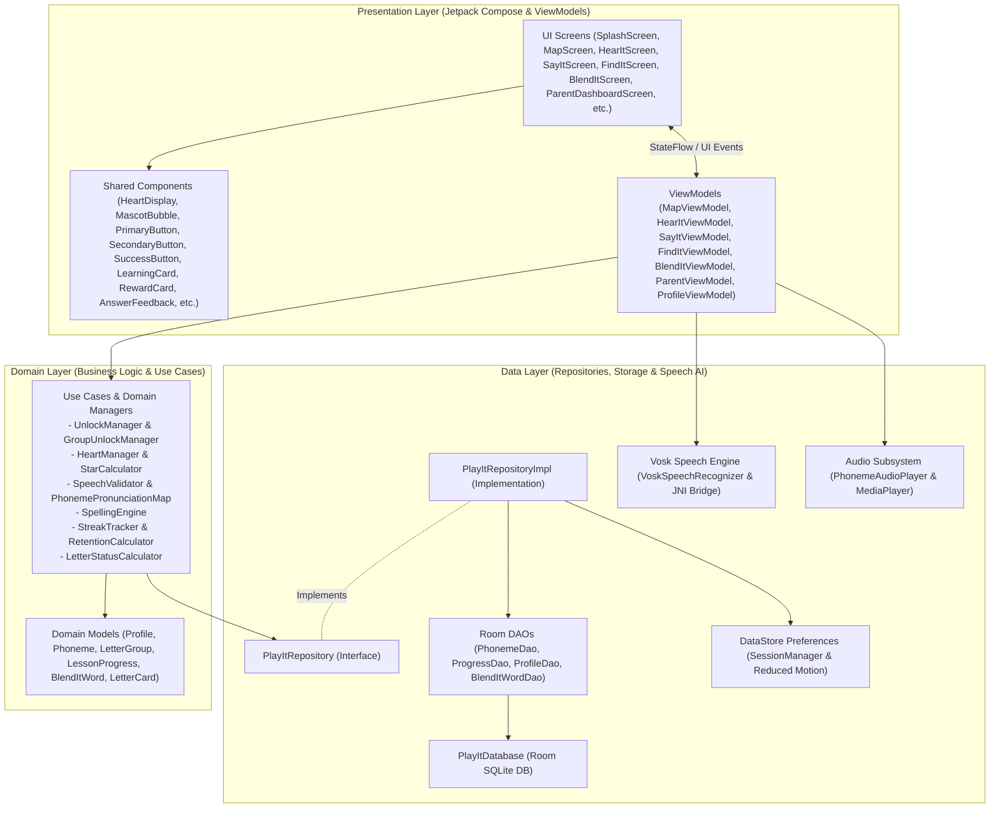

# playIT Architecture Overview

This document provides a comprehensive technical overview of **playIT (BasaTrack)**'s software architecture, following Android's recommended **MVVM + Clean Architecture** design pattern.

---

## 1. High-Level Architecture Diagram

---

## 2. Layering & Component Responsibilities

### Presentation Layer
* **Jetpack Compose UI**: Unidirectional Data Flow (UDF) rendering UI state and emitting user interaction events.
* **Shared Components**: Standardized UI components built with Design System v1.0 tokens (`Color.kt`, `Type.kt`, `Spacing.kt`, `Shape.kt`, `Elevation.kt`).
* **ViewModels**: Manage screen-level state exposed via `StateFlow` and handle background coroutine orchestration.

### Domain Layer
* **Domain Models**: Pure Kotlin data classes representing the core entities of the Marungko literacy curriculum.
* **Use Cases**: Encapsulate pure business rules (e.g., unlocking logic across 7 letter groups, 28-phoneme pronunciation fallback mapping, heart/star calculations, retention tracking).

### Data Layer
* **PlayItRepositoryImpl**: Single source of truth for persistent application state, abstracting storage origins from the Domain layer.
* **Room Database**: Local offline persistence storing profiles, letter groups, phonemes, word lists, and progress tracking.
* **DataStore**: Lightweight persistent key-value storage for `activeProfileId` and accessibility settings (`reducedMotion`).
* **Vosk Speech AI**: Offline edge-AI speech recognition engine evaluating spoken phonemes using embedded acoustic models without cloud dependencies.
